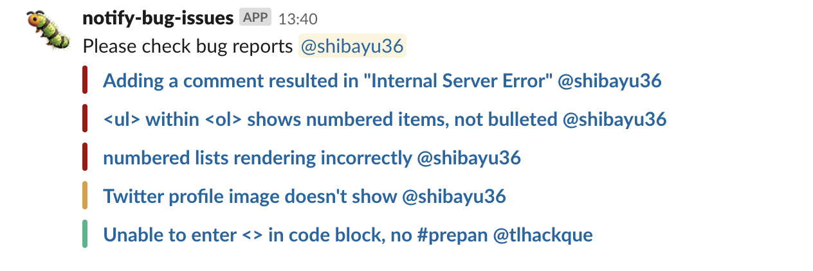

# notify-issues-to-slack

[](https://travis-ci.org/shibayu36/notify-issues-to-slack)
[](https://opensource.org/licenses/MIT)

This project is alpha quality.  The interface may change in the future.

## Description
The CLI tool to notify Github issues and pull requests to Slack with color like following.  It is useful for review reminder and checking issues regularly.



## Installation

### go get
```
$ go get github.com/shibayu36/notify-issues-to-slack
$ notify-issues-to-slack --help
```

### Docker
```
$ git clone https://github.com/shibayu36/notify-issues-to-slack.git
$ cd notify-issues-to-slack
$ docker build -t notify-issues-to-slack .
$ docker run --rm notify-issues-to-slack -help
```

### Built binaries
Built binaries are available on gihub releases.
<https://github.com/shibayu36/notify-issues-to-slack/releases>

## Synopsis

```
$ notify-issues-to-slack -github-token=... -slack-webhook-url=... -query='repo:shibayu36/notify-issues-to-slack state:open label:"bug"' -text="Please check bug reports @shibayu36"
```

## Usage
You can post issues and pull requests matched by `-query` to slack.  By `-query` options, you can use all syntax on [Searching issues and pull requests](https://help.github.com/en/articles/searching-issues-and-pull-requests) document.

```
$ notify-issues-to-slack -github-token=... -slack-webhook-url=... \
    -query='repo:shibayu36/notify-issues-to-slack state:open label:"bug"' \
    -text="Please check bug reports @shibayu36" \
    -channel="bug-report-channel" # slack channel to be posted
```

Github doesn't support relative time query, but `-query` option supports this.

```
$ notify-issues-to-slack -github-token=... -slack-webhook-url=... \
    -query='repo:shibayu36/notify-issues-to-slack state:open label:"bug" created:<now-1w' \
    -text="Please check bug reports made more than a week ago @shibayu36"
```

You can colorize issue attachments using `-danger-filter` and `warning-filter`.  Like `-query` option, you can use github's search query.  Following example colorize an issue danger if its last update is a week ago, and colorize an issue warning if its last update is three days ago.

```
$ notify-issues-to-slack -github-token=... -slack-webhook-url=... \
    -query='repo:shibayu36/notify-issues-to-slack state:open label:"bug"' \
    -danger-filter='updated:<now-1w' \
    -warning-filter='updated:<now-3d'
```

Of course, you can customize slack username and icon.

```
$ notify-issues-to-slack -github-token=... -slack-webhook-url=... \
    -query='repo:shibayu36/notify-issues-to-slack state:open label:"bug"' \
    -username='bug reporter' \
    -icon-emoji=':bug:'
```

If you use Github Enterprise, please specify `-github-api-url`.

```
$ notify-issues-to-slack -github-token=... -slack-webhook-url=... \
    -github-api-url='https://ghe.example.com/api/v3'
    -query=...
```

## Format
If you want to customize text's and attachment's format posted to slack, `-text` and `-issue-text-format` options are useful.  You can use [text/template](https://golang.org/pkg/text/template/) syntax in `-text` and `-issute-text-format`.

`[]github.Issue` is passed to `-text` as `.`, and `github.Issue` is passed to `-issue-text-format` as `.`.  `github.Issue` struct is described in [go-github document](https://godoc.org/github.com/google/go-github/github#Issue).

For example, you can use following command if you want to post "please review them" when issues are found, and to post "no review request" when issues are not found by your query

```
$ notify-issues-to-slack -github-token=... -slack-webhook-url=... \
    -query=...
    -text="{{ if . }}please review them @channel{{ else }}no review request{{end}}"
```

And following command customizes each issue's format.

```
$ notify-issues-to-slack -github-token=... -slack-webhook-url=... \
    -query=...
    -issue-text-format="{{.GetTitle}}: created by @{{.GetUser.GetLogin}} at {{.GetCreatedAt}}"
```

## Useful queries
Following command colorizes warning when no reviewer is assigned, and colorizes danger when no reviewer is assigned since two days ago.

```
$ notify-issues-to-slack -github-token=... -slack-webhook-url=... \
    -query='repo:shibayu36/notify-issues-to-slack label:"review required" state:open' \
    -warning-filter="type:pr review:none" \
    -danger-filter=""updated:<=now-2d type:pr review:none"
```

Following command notifies issues with "In Progress" label but without assignee.

```
$ notify-issues-to-slack -github-token=... -slack-webhook-url=... \
    -query='repo:shibayu36/notify-issues-to-slack label:"In Progress" state:open no:assignee' \
    -text='Do you forget deciding the assignment?'
```

Following command notifies pull requests assigned me as reviewer.

```
$ notify-issues-to-slack -github-token=... -slack-webhook-url=... \
    -query='repo:shibayu36/notify-issues-to-slack state:open type:pr review-requested:shibayu36'
```

## Author

[shibayu36](https://github.com/shibayu36)
